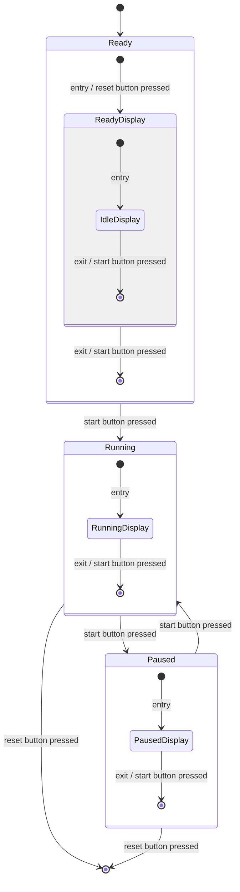
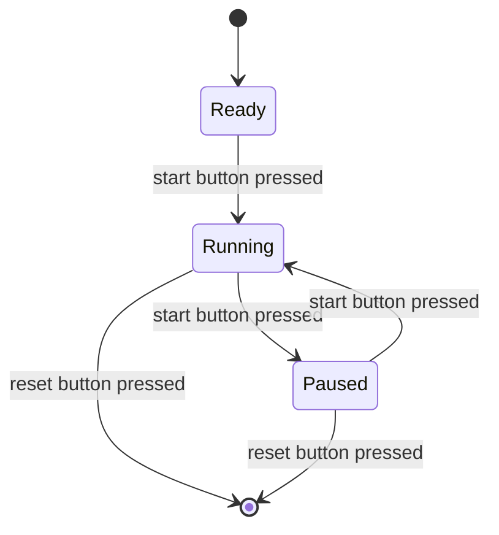

数年前にAIを離れ現在はフロントエンドをやっているのですが、半年くらい前に思い切り引き戻されました。画像生成AIにおけるmidjourneyとstable diffusionの登場です。[noteのCTO深津さんが記事を出した](https://note.com/fladdict/n/n13c1413c40de)と思ったのも束の間、急速に進化を果たしました。
[絵柄の固定・ポーズの指定](https://twitter.com/8co28/status/1627129867514052609)・[マシンスペック](https://github.com/FMInference/FlexGen)など、日々さまざまな問題を解決しながら新たな技を身につけています。

しかし、同等かそれ以上に話題になっているのは大規模言語モデル(Large Language Model)かもしれません。ChatGPTが話題になった思ったら、BingやPerplexity,You.comなど大規模言語モデルを交えたサービスが次々と登場しました。

活用方法もたくさん見つけられており、私は特に以下の二つの記事が好きです。

https://note.com/fladdict/n/n5043e6e61ce3
https://note.com/d_v_osorezan/n/n48a0a0008e96

「感情回路」の記事がに、入力(プロンプト)でここまで変わるのかと感動したことを覚えています。

非常にわくわくする技術なのですが、ここまで精度の高い出力が得られると少しの恐ろしささえ覚えました。
その期待と不安の混じった感情は、安宅さん(「イシューから始めよ」の著者)と松尾さん(「人工知能は人間を超えるか」の著者)の登壇資料を拝見しさらに大きくなりました。

https://note.com/akihisa_shiozaki/n/n4c126c27fd3d
「20230217_AIの進化と日本の戦略_松尾研.pdf」「230217 LDP3 安宅ed2.pdf」参照

> 人材育成方針を劇的に転換する必要
> **・エンジニアとそれ以外の垣根は急激に小さくなる**
> **・AIxデータを使い倒すことは本当に読み書きそろばんに**
> **・決まった答えがあるケースにおいて、多々与えらえれた問いに早く正確な答えを出すことの価値は急激に小さくなる**
> 
> 「230217 LDP3 安宅ed2.pdf」p.23より引用

数年前からよく言われていたことなのですが、今発言することの重みが強く感じられます。しかも対象が**エンジニア**で、**決まった答えがあるケース**だからです。

## はじめに
上記を受けて本記事を執筆することにしました。
「なんとなくそうなんだろう」と予想はできますが、結局のところ試してみないとわかりません。

本記事の構成は以下の通りです。

- 「プログラミングに求められることの再考」と「AI時代のプログラミング」
- 実験方法
- 結果と考察
  - 同値分割・境界値分析テスト
  - デシジョンテーブルテスト」
  - 状態遷移テスト
  - 組み合わせテスト
- まとめ
- おわりに

まずプログラミングに求められることを少し考えてみます。
これはそもそものプログラミングの価値、AIによるプログラミングの問題やその解決策を整理するためです。

## 「プログラミングに求められることの再考」と「AI時代のプログラミング」
プログラミングについて話す上で、前提を揃えるためまずいくつか定義を覗いてみます。
https://kotobank.jp/word/%E3%83%97%E3%83%AD%E3%82%B0%E3%83%A9%E3%83%9F%E3%83%B3%E3%82%B0-8463

共通項を抜き出しながら私たちの業務に照らし合わせると、
1. デザインや仕様をもとに
2. 問題やタスクを考え
3. 一連の手順をコードに起こし
4. それを検証すること

と言えそうです。

この中でもコアな部分は「タスクの分析とコーディング」ではないでしょうか。私自身、ライブラリのドキュメント, MDNやGithub issuesに当たりながら日々コードを書いています。
タスクを細分化することでロジックを通し妥当なプログラムを作り上げ、元のデータから目的となるの理想的なデータを作り上げます。

これを逆の視点から考えてみると、私たちは**理想のデータ変換**のために「タスクの分析」と「一連の手順に妥当性を持たせる」行為をしていると言えるでしょう。結局のところ、アプリケーションはある保存されたデータが適切な形でユーザに届けば良いからです。

この正しいデータが届くかどうかを保証するため、昨今だと自動テストも重要になってきました。

これらのことは非常に示唆があると筆者は考えます。つまるところ、
- **データが正しく加工される**
- **その動作が保証されている**

ことが実現できていれば、その加工の過程である**プログラムの妥当性に人間が関心を持つ必要はない,言い換えれば内部のロジックを気にする必要はない**かもしれないということです。

これは実は日常生活に目を向けると私たちがよく体験していることです。
- PCの仕組みを知らないが、キーボードに入力し画面から出力を得ている
- カメラの構造を知らないが、ボタンを押したら写真が保存される
- 洗濯乾燥機に服や洗剤を入れると、コースを選択すれば服が綺麗かつ乾いた状態で出てくる

中の仕組みひとつずつ追わなくても、私たちは**経験的に動作が保証されることを知っている**たくさんの道具が利用できます。


より抽象的な「思考法」になぞらえると、**帰納と演繹の違い**になるでしょう。
私たちはこれまで「AだからB」のように **演繹的にプログラミングを行い正しい動きを実現してきましたが**、テスト(理想的な動作)と適当なプログラムを用意できれば「A,B,Cのテストが通っているから正しく動くことがわかる」という**帰納的な動作保証とプログラミング**が可能になるわけです。


ここにおいて、AIによるコードの自動生成の課題が解決でき真価を発揮します。AIは短時間でコードを出力しますが、思考の過程を得ていない(我々が観測できない)ため動作の保証がありません。
それであれば、**AIを用いたプログラミングでは帰納的な解決策をとれば良い**ということです。


つまり、
- 全体仕様の設計
- テスト仕様の設計
- 生成されたテストコードのチェック(人間によるチェック)

さえ行えばあとはAIに任せられる**AI駆動なプログラミング**が実現できます。

## 実験方法
上記の仮説がどの程度当てはまるのか・どの程度のクオリティが実現できるのか検証するため、以下の条件でコードの自動生成を行いました。

まず、実践的なケースにするため仕様は[ソフトウェア技法練習帳](https://gihyo.jp/book/2020/978-4-297-11061-1)を参考に作成しました。主に以下の4つをお借りしています。なお、テスト設計の模範解答については該当箇所をご覧いただくようお願いします。
> - 1.1 温度によって表示を変えるペット用室温系
> - 2.1 1杯目のビールの価格
> - 3.1 ストップウォッチの動作
> - 4.3 合コン会計用アプリの検証
> 
> ※電子書籍のためページ番号省略

ツールはChatGPTを使用し、入力プロンプトは以下の形式に従いました。
```markdown
優秀なエンジニアのように振る舞ってください。
以下の仕様をもとにjestのテストコードを作成してください。
また、仕様を満たしあなたが出力したテストコードを通過する関数を{出力形式を定義。Typescript, Reactなど}で作成してください。

## 仕様
### 概要
// 仕様の全体感を箇条書きで記述

### 画面レイアウト
// UIが存在する場合箇条書きでパーツごとに記述

### 動作
// 動作を箇条書きで記述

なお出力形式は以下とします。
まず{テスト仕様(同値分割法など)}を{出力方式(mermaid)}形式で作成し、その後{追加の命令文(任意)}テストコードを作成してください。

## 出力形式
- 概要
- テストコード
- 実装例

私たちがこのタスクで最高の結果を出すためにステップバイステップで考えてください。
```

上記のプロンプトには
- Chain-of-Thought Prompting
- Zero-Shot CoT
- Self Consistency
- PAL

などの技法を使いました。
ざっくりまとめると「言語モデル自身の整合性の向上を促し、さらにプログラム（今回は中間生成物のテストコード)を与え計算機としての理解を助ける」手法です。

上記をもとに、それぞれ
- 同値分割法・境界値分析
- デシジョンテーブル
- 状態遷移テスト
- 組み合わせテスト

のテストとそのテストを通過するコードの生成をお願いしました。


## 結果と考察
結論からいうと、100%ではありませんでした**が期待以上の結果が得られました**。今でも感動してます。

長くなってしまったためGoogleDriveからpdfを確認してください。
https://drive.google.com/drive/folders/1NuDQcoH0q73aDDt-UlKYUz3sXVMSGkJo?usp=share_link

以下、pdfのうち重要だと思った点をピックアップします。

### 同値分割・境界値分析.pdf
(確認しやすいようCodeSandboxへ転載しました)
https://codesandbox.io/s/shi-wen-ji-nopuroguramu-ghiz7j?file=/test/code.test.ts

まず入力プロンプトがこちらですが、
```markdown
テックリードのように振る舞ってください。
以下の仕様をもとにjestのテストコードを作成してください。
また、仕様を満たしあなたが出力したテストコードを通過する関数をTypeScriptで作成してください。

## 仕様
### 前提
- 室温計のプログラム

### 画面レイアウト
- 室温表示欄
- メッセージ欄

### 動作
- 室温が「24.0℃未満」の場合、メッセージ欄に「寒い」と表示
- 室温が「24.0℃以上26.0℃未満」の場合、メッセージ欄に「快適」と表示
- 室温が「26.0℃以上」の場合、メッセージ欄に「暑い」と表示
- 室温計の精度は0.1℃単位

なお出力形式は以下とします。
テストコードは同値分割法(Equivalence Partitioning Testing)と境界値分析(Boundary value analysis)を用いてください。

## 出力形式
- 概要
- テストコード
- 実装例

私たちがこのタスクで最高の結果を出すためにステップバイステップで考えてください。
```

境界値を正しく定義したテストコードが生成されています。
```javascript
describe("室温計のプログラム", () => {
  test("室温が24.0℃未満の場合、「寒い」と表示される", () => {
    expect(getTemperatureMessage(23.9)).toBe("寒い");
  });

  test("室温が24.0℃の場合、「快適」と表示される", () => {
    expect(getTemperatureMessage(24.0)).toBe("快適");
  });

  test("室温が24.1℃の場合、「快適」と表示される", () => {
    expect(getTemperatureMessage(24.1)).toBe("快適");
  });

  test("室温が25.9℃の場合、「快適」と表示される", () => {
    expect(getTemperatureMessage(25.9)).toBe("快適");
  });

  test("室温が26.0℃の場合、「暑い」と表示される", () => {
    expect(getTemperatureMessage(26.0)).toBe("暑い");
  });

  test("室温が26.1℃の場合、「暑い」と表示される", () => {
    expect(getTemperatureMessage(26.1)).toBe("暑い");
  });
});
```
コードも問題なさそうです。
```typescript
export function getTemperatureMessage(temperature: number): string {
  if (temperature < 24.0) {
    return "寒い";
  } else if (temperature >= 24.0 && temperature < 26.0) {
    return "快適";
  } else {
    return "暑い";
  }
}
```

### デシジョンテーブル.pdf
まず良いと思ったのが、複雑に見える日本語の仕様を読み解いてくれる点です。
**AIで出力した後で**全体の出力から仕様を理解しました。

また、以下のプロンプトを加えたためテーブルが作成できています。
見た目にはわかりやすいのですが、少々理解しにくい構造であることが難点です。

```
テストコードは作成する際はデシジョンテーブル(Decision Table)を作成し、それを参考に試作業を行ってください。
```

|条件|通常価格|ハッピーアワー価格|クーポン価格|
|:--|:--|:--|:--|
|利用時間がハッピーアワーかつクーポンを使用する場合|100円|100円|100円|
|利用時間がハッピーアワーかつクーポンを使用しない場合|490円|290円|490円|
|利用時間がハッピーアワーでなく、クーポンを使用する場合|100円|100円|100円|
|利用時間がハッピーアワーでなく、クーポンを使用しない場合|490円|490円|490円|

これは
- あらかじめテーブルの構造を指定する
- テーブルを出力させてブラッシュアップさせたのちコードを出力する

など工夫しより出力を限定すると良いかもしれません。

テストコードとプログラム自体は正しく出力されています。
https://codesandbox.io/s/birunozhi-duan-puroguramu-22wmwx

### 状態遷移.pdf
先ほどのデシジョンテーブルと似ていますが、以下のプロンプトによりこちらはmermaid形式で出力できました。
```
まず状態遷移図および状態遷移表ををmearmaid形式で作成し、その後その図をもとにテストコードを作成してください。
```
```
stateDiagram-v2
    [*] --> Ready
    Ready --> Running : start button pressed
    Running --> Paused : start button pressed
    Paused --> Running : start button pressed
    Running --> [*] : reset button pressed
    Paused --> [*] : reset button pressed
    state Ready {
        [*] --> ReadyDisplay : entry / reset button pressed
        ReadyDisplay --> [*] : exit / start button pressed
        state ReadyDisplay {
            [*] --> IdleDisplay : entry
            IdleDisplay --> [*] : exit / start button pressed
            state IdleDisplay {
                TimeDisplay : show "00:00"
            }
        }
    }
    state Running {
        [*] --> RunningDisplay : entry
        RunningDisplay --> [*] : exit / start button pressed
        state RunningDisplay {
            TimeDisplay : show elapsed time
        }
    }
    state Paused {
        [*] --> PausedDisplay : entry
        PausedDisplay --> [*] : exit / start button pressed
        state PausedDisplay {
            TimeDisplay : show elapsed time
        }
    }
```

しかし、実はこの出力は正しく動きません。
ドキュメントを見ると`show`という命令は存在しないことがわかります。
https://mermaid.js.org/syntax/stateDiagram.html

AIが他のツールと混同している可能性がありますが、ChatGPTが2021年までのデータで学習しているためでしょう。
作図の精度を上げようとするならばPlantUMLなどのよりメジャーなツールの方が良いかもしれません。

showを含む記述を消せば動作が確認できました。


複雑すぎる感じも否めませんので、さらに削ってシンプルにしても良いかもしれません。



こちらもCodesandboxにのせてあります。
https://codesandbox.io/s/sutotupuuotuti-rtyq0c?file=/index.html

こちらも全体的に問題なく素晴らしいですが
- 昨今の事情を鑑みるとClassでの作成は望ましくないケースがある
- 時間経過のテストをモックを使わずに行っている
  
という点は気になります。
こちらについては最初の指示条件に入れたり、追加のプロンプトを入力すれば良いでしょう。

### 組み合わせ.pdf
Reactをここまでの形で出力してくれること自体がすごいのですが、残念ながらこちらは期待した動作ではありませんでした。
https://codesandbox.io/s/hui-ji-yong-apuri-39j9gl?file=/src/App.tsx:2961-2967

「スライダーの値が変更できない」「計算結果が1人当たりではない」「計算結果におかしな繰上げが含まれている」などの問題があります。

理由の一つにはChatGPT(GPT-3.5)の限界が挙げられますが、一方で **プロンプトの与え方(プロンプトエンジニアリング)** にも問題があったと考えています。

一度の命令でアプリ開発を命じてしまい、段階を踏んだコード化の手伝いができませんでした。
大雑把な命令を投げると、テストも単体だけでなく結合~E2Eレベルになり粒度も揃いません。

後日再チャレンジしようと思っていますが、その際には
1. コンポーネントを切り分ける
2. 入出力を明確にする

といった戦略で臨もうと考えています。我々と同じく、入出力さえ教えてあげれば内部を気にすることなくフルに文脈を意識することができるはずです。


## まとめ
以上が今回の実験結果となります。繰り返しになりますが、非常に満足のいく結果が得られました。やったこととして「ほぼ仕様を移すだけ」なのに対し、実際に動作するコードが得られていることの費用対効果が抜群です。

おおよそのピックアップとでき実験結果全体も共有できましたが、上記の施行中に得た気づきをもう少しだけまとめておきます。

- AIによるコード生成にプロンプトエンジニアリングは必須
- 関数型プログラミングのパラダイムと相性が良いか
- プログラミングに必要なスキルは設計力か

まずプロンプトの最適化(プロンプトエンジニアリング)はAIを用いた開発で最も重要だと考えました。[note深津さんの記事](https://note.com/fladdict/n/n5043e6e61ce3)を見てもわかるように、指示の仕方で大規模言語モデルは出力結果を大きく変えます。これはおそらく人に指示する時も同じで、前提や文脈を正しく与えることで出力される結果が良い方向に向かうのでしょう。（可能性空間の限定と言われます）
とはいえ、大規模言語モデルはある程度知識を持ち察することができるのでこの能力をうまく使うこともまた重要です。詳細は後述します。

他に、関数型プログラミング([おすすめの文献](https://zenn.dev/tockri/books/dcaf6c55e64448))と相性が良いと感じました。プログラムを「入力が変換され出力が得られるもの」とすることで文脈の理解なくAIがコードを生成できます。
「文脈」にこだわる理由は大規模言語モデルは未だ計算コストが高く、**保持できる文脈に限りがあるから**です。一挙に情報を与えると抜け漏れが発生しますが、ある程度細かく分けることによりそれだけクオリティの高いコードが期待できます。
また、関数型プログラミングは外部依存が少ないため、副作用を抑えられれば我々が修正する頻度もわずかになるでしょう.

再度に、ここまでの実験で最も強く感じたことは「今後アプリケーション開発者に求められることは設計力になっていくだろう」ということでした。上記4つのテストとコードは2時間かからず作ることができましたが、私が一人で作成する場合
- 仕様の理解
- 実装
- テストケース作成
  
で数日かかるはずです。

今後できるだけコーディングを任せていきたいと思いますが、この際に設計力がなければAIに任せられる部分がどんどんと細かい粒度になっていくと感じました。良い粒度で分割する方法を知らなければ「組み合わせ.pdf」のように精度の低い出力が得られてしまいます。

忘れていけないのは、初期開発でコードが自動生成できたとしても運用を続ければリファクタリングが発生するということです。この際に適切な分割ができていなければスパゲティは避けられずAIにどんどん「文脈」を与える必要が発生し、結果コードの出力に期待できなくなります。
最終的に作業をするのは今のところ人ですので、共通認識を持ちそのプロダクトに適切なコードを生成させられる知識が必要になるのではないでしょうか。

この際に助けとなるのが、先ほど話した「大規模言語モデルは知識を持つ」という特徴です。設計するには我々が設計原則を知らなくてはいけませんが、有名なSOLID原則・DRY原則・KISS原則などは既にAIが知っていることです。つまり最初に「原則の特徴を述べさせれば」あとはその文脈に従いコードを生成してくれます。
基礎的な設計力を身につけ、疑問に思った場合は都度言語モデルに質問しながら作業するのが良いかもしれません。


## おわりに
ここまでご覧いただきありがとうございました。pdfや参考文献と合わせると少しボリュームが大きかったと思います。
自分の持ちうるAIの知識とアプリケーション開発を組み合わせて執筆しました。何を書いて何を書かないか、非常に迷ったのですがなんとか形になったと思います…

実はこの記事を公開するか悩んでいました。恣意的であり、強い批判を受けるのではないかと思っていたためです。
しかし、どうやらこのAIによる作業自動化の流れは止まらず数年前の翻訳に始まり・囲碁や将棋の強化学習・画像分類・音声認識・自動運転、そしてクオリティの高い絵を描くようになりました。
内心認めたくなかったのですが、プログラミングもその対象のようで安宅さんの「エンジニアとそれ以外の垣根は急激に小さくなる」という言葉が強く刺さります。

頭から離れず眠れない時もあったのですが、そのうち、他の開発者も自分と同じ気持ちになるかもしれないと考えました。であればそれはどうにか解決したいですし、産業革命、PCの登場、他のAI事例を調べるうちに、この流れは憂いても仕方ないことだと思うようになりました。

なので、今思えばこれまでに書いた文章は説得であったり、自分に言い聞かせていることなのかもしれません。「時代に適応し、大事にするものを見つめ直したい」というような…

ここまで読んでいただき本当にありがとうございました。
これからもよろしくお願いします！

---

**追記**
AIの進化が早く、一人でキャッチアップするのは難しいと思いDiscordのサーバーを作りました。twiterだとまだセンシティブな話題だと思いますが、サーバ内ではざっくばらんに話せればと思っています。
みんなで研究すれば成長も早いはず！ゆくゆくはAI駆動の開発手法についてOSSでまとめたいな〜など思っています

運営初心者なのでご迷惑おかけすることも多いと思うのですが、ご興味あればお気軽に参加していただけると嬉しいです

https://discord.gg/2zc4kVxNxP


