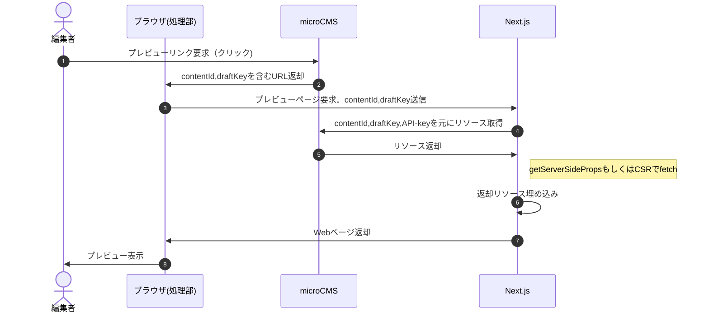
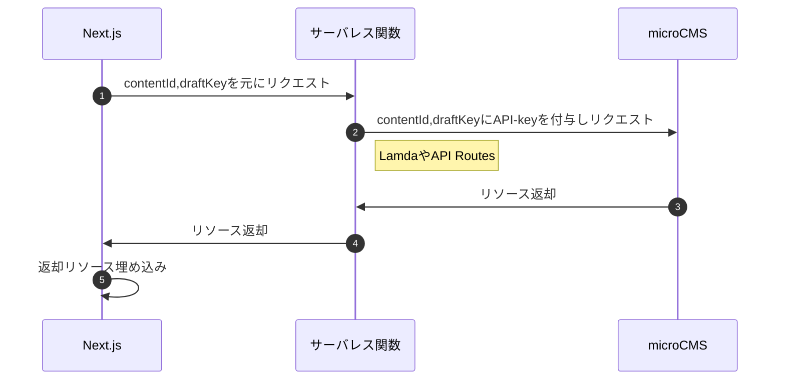

JSフレームワークでWeb制作をする際に問題となるのがプレビュー環境です。 他のCMSなどと異なり一から自前で実装することになります。  
この複雑さ解消を目的に、本記事ではNext.jsとmicroCMSを組み合わせたプレビュー環境の実装例を紹介します。

## 対象
- Next.jsで簡単な開発・デプロイ経験がある方
- microCMSに少しでも触ったことがある方

## 全体像と流れ
前提として、「JSフレームワークを用いたWebサイト制作におけるプレビューページ」はCSRなアプリケーションを作成する感覚と似ていると捉えましょう。
1. 該当ページにアクセスする
2. fetchが飛ぶ
3. 情報が埋め込まれる
4. 表示される

といった流れです。（そもそもCSRなどレンダリング手法が曖昧な方は[コチラ](https://www.patterns.dev/posts/rendering-introduction/)や[コチラ](https://zenn.dev/akino/articles/78479998efef55)を参照ください）  

SSGであれば別途CSRのページを用意して、SSRであればそのままSSRかCSRのページを用意することとなります。
まずは図で全体感を押さえておきます。細かい部分はこれから掴んでいきますので、ざっと目を通してください。（ちょっと雑なのはご愛嬌です)



重要な概念はここに出てくる`contentId`,`draftKey`を含む`URL`です。 

## 実装
さっそく実装方法を考えていきます。　　
プレビュー表示はCSRなアプリケーションに近いとお伝えしました。したがって

1.  URLの割り当てられたページが存在する
2.  データをフェッチする機構がある
3.  データを受け取るコンポーネントがある

の3つが達成できれば問題なさそうです。まずはすぐに雛形の作れそうな1番と3番を実装してみましょう。

```tsx
// src/pages/preview/index.tsx
import type { NextPage } from 'next'
import { useState } from 'react'

const NewsPage: NextPage = () => {
  const [data, setData] = useState()
  useEffect(() => {
    setData({
    title: 'サンプルタイトル',
    publishedAt: 'サンプル日時',
  });
  }, []);

  return (
    <div>
      <h1>{data.title}</h1>
      <p>{data.publishedAt}</p>
    </div>
  );
}

export default NewsPage
```
これでひとまず`https://ドメイン名/preview/` にアクセスすれば`サンプルタイトル サンプル日時`と表示されるようになりました。  
しかし、運用時に利用する編集者はこのURLにどうアクセスすれば良いでしょうか。ドキュメントを用意するなどの解決策はありそうですが負担がかかりそうです。

この問題を解決するためにmicroCMSには「画面プレビュー設定」機能があります。

以下のような設定をすると、

記事画面のこちらのボタンから設定したURLにアクセスできるようになります。


これで編集者がプレビューを確認できるようになりました。

このままでは情報が固定されておりプレビューの役割を果たせませんので、次にデータフェッチの機構を組み込みます。
以後ニュースページとして話を進め、[microCMS-js-SDK](https://github.com/microcmsio/microcms-js-sdk)を用います。

```tsx
// libs/client.js
import { createClient } from "microcms-js-sdk";

export const client = createClient({
  serviceDomain: "サービス名",
  apiKey: process.env.NEXT_PUBLIC_MICROCMS_API_KEY,
});
```

:::message alert
現時点でのコードはAPI-keyの漏洩など、要件によってはセキュリティ的な問題の可能性があります。詳しくは後述のセキュリティの項をご参考ください。
:::


```tsx
// pages/preview/index.tsx
import type { NextPage } from 'next'
import { useState } from 'react'

const NewsPage: NextPage = () => {
  const [data, setData] = useState()
  useEffect(() => {
    const getNewsData = async () => {
      const res = await client.get({
        endpoint: "news",
        contentId: "特定のニュースID",
      });
      setData(res);
    };
    getNewsData();
  }, []);

  return (
    <div>
      <h1>{data.title}</h1>
      <p>{data.publishedAt}</p>
    </div>
  );
}

export default NewsPage
```

これで`特定のニュースID`の情報が表示されるページになりました。  
さらに拡張し、`特定のニュースID`はURLから取得できるように改変しましょう。

```tsx
// https://domain.com/preview/?slug=特定のニュースID
// src/pages/preview/index.tsx
import type { NextPage } from 'next'
import { useState } from 'react'


const NewsPage: NextPage = () => {
  const [data, setData] = useState()
  const router = useRouter();
  useEffect(() => {
    const getNewsData = async () => {
      if(!router.isReady) return //useRouterの初期化が完了したら実行
      const res = await client.get({
        endpoint: "news",
        contentId: router.query.slug, //URLから取得
      });
      setData(res);
    };
    getNewsData();
  }, [router]);　//依存配列にrouterを追加

  return (
    <div>
      <h1>{data.title}</h1>
      <p>{data.publishedAt}</p>
    </div>
  );
}

export default NewsPage
```

Next.js側のURL構造に変化がありましたのでmicroCMSの設定も変更します。

`?slug={CONTENT_ID}`を追加しました。  
microCMSの画面プレビューには**該当記事の記事IDを動的に埋め込む機能**があります。これによりプレビューページに飛びつつ該当記事のIDをNext.js側に渡す、そのページ情報を埋め込むといったことが実現できるわけです。

最後に、現時点では公開済みの記事しか取得できないため下書き状態でもアクセスできるよう`darftKey`も渡してあげましょう。
```tsx
// https://domain.com/preview/?slug=特定のニュースID&draftKey=特定のニュースIDの下書きキー
// src/pages/preview/index.tsx
import type { NextPage } from 'next'
import { useRouter } from "next/router";
import { useState } from 'react'


const NewsPage: NextPage = () => {
  const [data, setData] = useState()
  const router = useRouter();
  useEffect(() => {
    const getNewsData = async () => {
      if(!router.isReady) return
      const res = await client.get({
        endpoint: "news",
        contentId: router.query.slug,
        queries: { draftKey: router.query.draftKey },
      });
      setData(res);
    };
    getNewsData();
  }, [router]);

  return (
    <div>
      <h1>{data.title}</h1>
      <p>{data.publishedAt}</p>
    </div>
  );
}

export default NewsPage
```


以上で、CSRでのプレビュー機能が実装できました。
この流れをシーケンスにすると先ほどの図のようになります。


## セキュリティ
先ほどの実装でプレビューが実装できました。基本的には上記で問題ないのですが、念の為いくつかセキュリティに関する注意事項をお伝えしようと思います。
重要なことは**API-keyの露出**と**権限設定**です。

説明した実装方法はCSRでありクライアント側でフェッチしています。つまり、クライアントのコードにAPI-keyが埋め込まれておりブラウザから容易に取得できるな状況です。
悪意ある第三者に全権限を持つAPI-keyが盗まれた場合、**公開を望んでいないデータの取得や書き換えが行われる可能性**があります。

したがって、繰り返しになりますがmicroCMSを扱う際はこの**API-keyの権限**と**秘匿化**について十分に注意しましょう。

### 権限設定

まず最初に行うべきはAPI-keyの権限設定です。まず、API-keyのデフォルト権限は **GET(リソースの取得)** に限定しましょう。
https://document.microcms.io/content-api/x-microcms-api-key#h9ab4ef6b46

これにより(API-keyは依然として閲覧可能ですが)書き込み系の処理は防ぐことができます。

### 秘匿化
場合によってはAPI-keyを露出させたくないケースもあると思います。
その際はサーバレス関数(Lamdaなど)の利用やSSRを検討しましょう。

以下のような構成をとり、サーバレス関数にAPI-keyを置くことによりクライアントへの露出が防げます。


また、インフラが限られますがSSRにおいて`getServerSideProps`を利用するのも手です。こちらもサーバー側での処理ですのでAPI-keyはクライアントにもれません。  
コード例は以下のようになるでしょう。
```tsx
// libs/client.js
import { createClient } from "microcms-js-sdk";

export const client = createClient({
  serviceDomain: "サービス名",
  apiKey: process.env.MICROCMS_API_KEY,
});
```
```tsx
import { client } from "../../libs/client";

export default function BlogId({ data }) {
  return (
    <main>
      <h1>{data.title}</h1>
      <p>{data.publishedAt}</p>
    </main>
  );
}

export const getServerSideProps = async (context) => {
  const data = await client.get({
    endpoint: "news",
    contentId: context.query.id,
    queries: { draftKey: context.query.draftKey },
  });

  return {
    props: { data },
  };
};
```
Next.jsでは`NEXT_PUBLIC_`の接頭辞の有無によって環境変数の利用場所を切り替えることができます。
https://nextjs-ja-translation-docs.vercel.app/docs/basic-features/environment-variables

API-keyを露出させたく**ない**ケースですので、`NEXT_PUBLIC_`を使わずサーバーで利用するよう設定しましょう。


:::message
上記のような対策をとったとしても、そもそものdraftKeyを含むURLが漏洩すると第三者のアクセスは可能になります。さらにセキュリティを強化する場合は環境を分ける、Basic認証を付与するなどの施策を追加しましょう。
またdraftKeyはmicroCMSの画面からかんたんに変更可能です。漏洩した場合の対策について、運営側あらかじめ対応を決めておくと良いかもしれません。
:::

## まとめ
今回はNext.jsとmicroCMSを用いたプレビュー実装方法とその留意点をまとめました。  
ホスティングサービスからもさまざまなプレビュー機能が提供されていますが、まずはこちらで紹介した方法で実装を試してみてください。  
一度理解すると、他のフレームワークやホスティングサービスでの実装も幾分かスムーズになると思います。

また、今回起用したuseEffectを用いたfetchは[useSWR](https://swr.vercel.app/ja)や[Tansatck Query(React Query)](https://tanstack.com/query/v4/docs/adapters/react-query)でシンプルにできます。こちらもぜひ試してみて下さい。